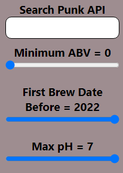

# 

### by mattser
 

About
=====

A Webpage developed in ReactJS to search through the [Punk Api](https://punkapi.com/) based on parameters given.
This project was developed in React and so mainly features:
* ReactJS
* JavaScript
* SCSS styling Components
* React Router

 

Specifications
==============
Create a React Webapp to:
* Display beverages in cards taken from the [Punk Api](https://punkapi.com/).
* Filter and display beverages based on a name input parameter.
* Filter and display beverages based on Alcohol Content
* Filter and display beverages based on their first brew date.
* Filter and display beverages based on their Acidity
* Contain Routes and Routed Elements

 

Current Features
================
* Developed in React
* Displays beverages in cards from the [Punk Api](https://punkapi.com/).
* Filters and displays beverages based on name, alcohol content and first brew date and maximum acidity.
* Dyanamic pagination
* About Section routed in

Screenshots
===========

*Search Parameters*

*Card Examples*

